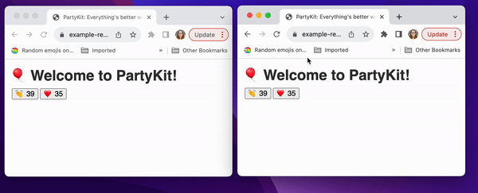

## 🎈 party-reactions

Welcome to the party, pal!

## Demo

The [demo](https://example-reactions.jevakallio.partykit.dev/) is a website that shows live reaction counters - as soon as someone reacts to your content, the counter is updated on all connected clients.

You can **create a new room with its own counter** by appending any room name to the URL. This means that you can easily implement separate counters for any subpage or section (for example, for any blog post or video on your website). See:
- **main room:** [https://example-reactions.jevakallio.partykit.dev/](https://example-reactions.jevakallio.partykit.dev/)
- **new room:** [https://example-reactions.jevakallio.partykit.dev/flowers](https://example-reactions.jevakallio.partykit.dev/flowers)

Every time you use a new identifier, a new room is automatically created.

**Each room is also its own API.** You can get the JSON data of the room by adding "party" between the main URL and the room name (except for the main room, which needs the name of "default"), see:
- **new room JSON:** [https://example-reactions.jevakallio.partykit.dev/party/flowers](https://example-reactions.jevakallio.partykit.dev/party/flowers)
- **main room JSON:** [https://example-reactions.jevakallio.partykit.dev/party/default](https://example-reactions.jevakallio.partykit.dev/party/default)

## Getting started

Please note that to run PartyKit, you need to have Node v. 17 or higher installed.

To explore the project, clone the repository and follow these steps:

1. Run `npm install` inside the project repository
2. Run `npm run dev`
3. You can either use the controls in the terminal to open the browser, or open `http://localhost:1999/` in your browser manually
4. Whenever you change and save the files, the page will automatically reload.

If you'd like to also run the Next.js app, in addition to the previous steps:

1. `cd` into `nextjs-example`
2. Run `npm install`
3. Run `npm run dev`
4. Open `http://localhost:300/` in your browser
5. Whenever you change and save the files, the page will automatically reload.

## Contents

In the application root directory, you'll find a PartyKit application that demonstrates live reaction counters, which includes a server and a client. Both are deployed via `partykit deploy`. The server was created to accommodate both client-side rendered apps, as well as SSR apps.

### Next.js

In the `nexjs-example` directory, there's a Next.js 13 app that demonstrates using the same API with React Server Components.
